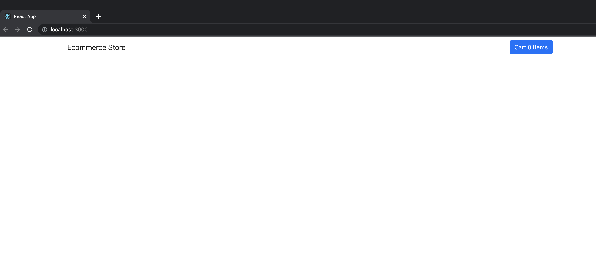
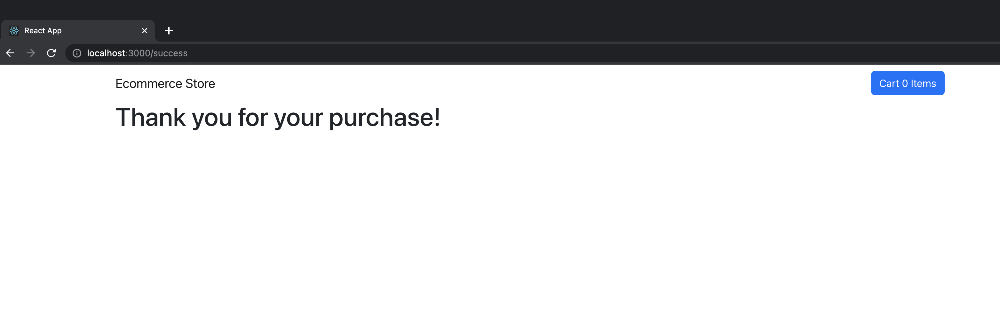
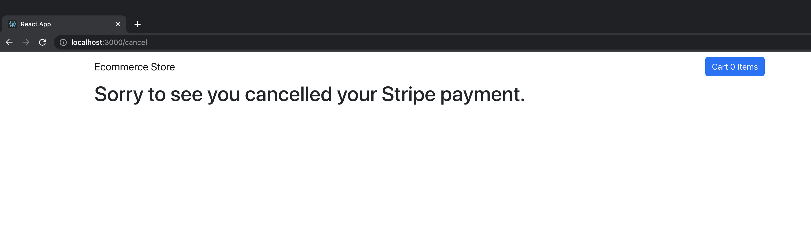

# Build a Shopping Cart With React JS & Stripe
Tutorial URL: https://www.youtube.com/watch?v=_8M-YVY76O8
Tutorial description: In this project, we will create a shopping cart using React and Stripe.

___________

### Software versions

### Problems in the project:
1. export 'CartContext' (imported as 'CartContext') was not found in '../CartContext'
	The problem was I didn't export the CartContext variable but just defined a immutable variable. The solution to the problem was to add the 'export' keyword before the 'const' keyword. 
	```
	// wrong
	const CartContext = createContext({
		items: [],
		getProductQuantity: () => {

		},
		addOneToCart: () => {

		},
		removeOneFromCart: () => {

		},
		deleteFromCart: () => {

		},
		getTotalCost: () => {

		}
	});
	```	
	```
	// correct
	export const CartContext = createContext({
		items: [],
		getProductQuantity: () => {

		},
		addOneToCart: () => {

		},
		removeOneFromCart: () => {

		},
		deleteFromCart: () => {

		},
		getTotalCost: () => {

		}
	});
	```
2. Cannot read properties of undefined (reading 'find')
	The problem was I wrote a duplicate setCartProducts() function  in the scope of the addOneToCart() function and wrapped the setCartProducts around the code for iterating over the cartProducts array instead of writing a JavaScript map function to iterate upon the cartProducts array.
3. TypeError: Failed to fetch
	The problem was the server sent a request to /checkout with https instead of http. Since there is no secure route via https the server failed to fetch anything from that route. 
	The solution was to change the string as below:
	```
		// wrong
		await fetch('https://localhost:4000/checkout'
		// correct
		await fetch('http://localhost:4000/checkout',
	```

### How to use
1. clone / download
2. npm install / yarn 
3. yarn start
4. Click 'add to cart' to initially add an item to the cart. Then, use the +/- buttons to increase or decrease the quantity of the item in cart.
5. Click 'Cart' to view what items are in your cart and the total sum of the quantities of all the items in the cart.


### Photos of project:
**Initial site**
 
**/success route**

**/cancel route**

**app functionality: add to cart, increment & decrement items in cart, view shopping cart total**

### Apps used:

### Coding styles I used:

### What I learned
1. I learned how important the 'export' keyword is in ES6 JavaScript web programming and how important it is to export variables and use them in a different file.
2. I learned that in E-commerce applications, for calculating the total of items in cart the programmer must multiply the item in the cart x the quantity of the item the customer wants ordered.
3. I learned that for expressions in JSX you must wrap the expression in parenthesis. At first I thought you can put functions in curly brackets and add method to them plainly 
```
	quantity * productData.price.someMethod(2) // what I thought

	(quantity * productData.price) // expression w/ parenthesis

	(quantity * productData.price).toFixed(2) // expression in parenthesis w/ method attached

```